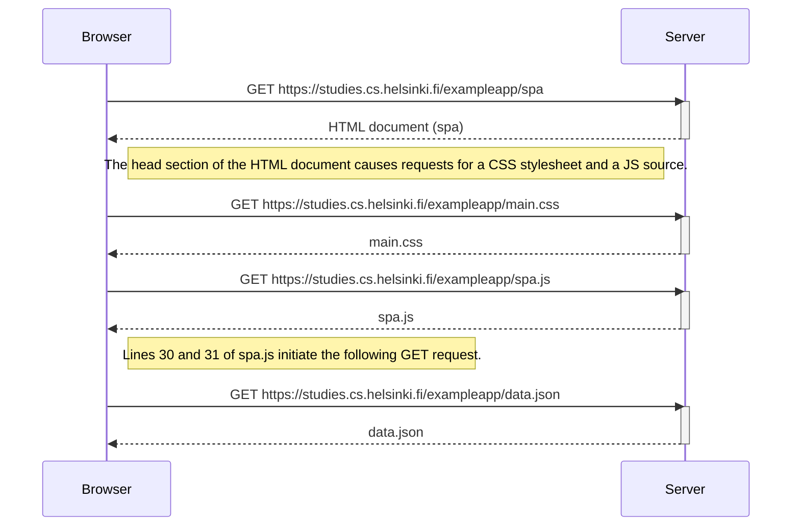

# 0.5: Single page app diagram

The SPA version of the app is very similar to the original version of the web app, although the contents of the HTML and JS files differ from their non-SPA counterparts.

